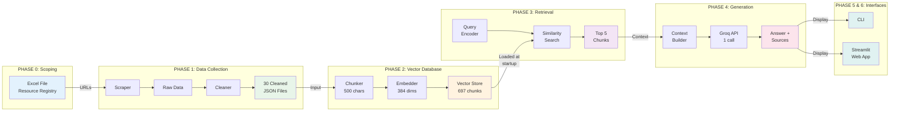
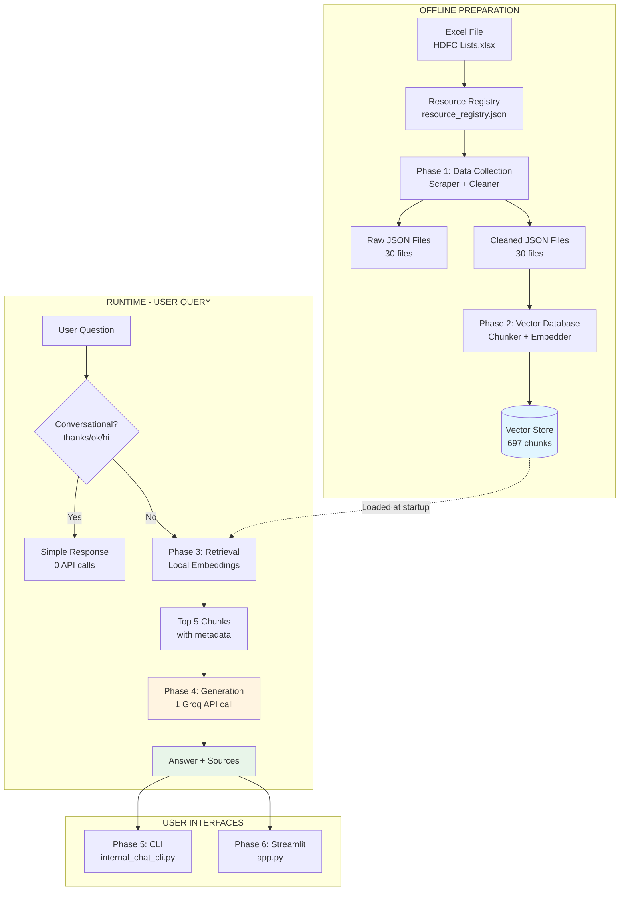
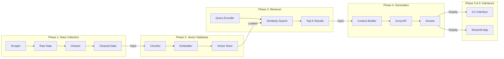
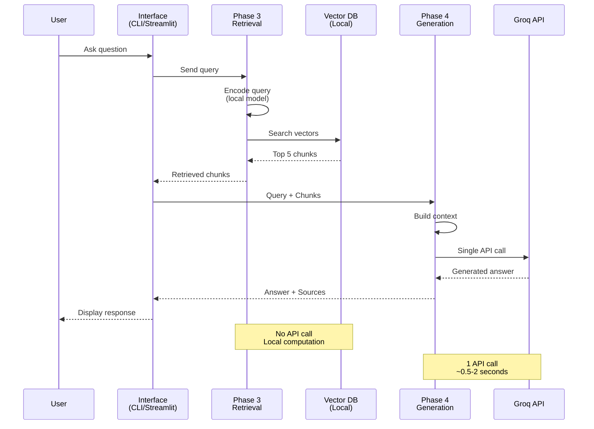

# RAG-based Mutual Fund FAQ Assistant - Complete Architecture & Documentation

## Table of Contents
1. [System Overview](#1-system-overview)
2. [Architecture Diagrams](#2-architecture-diagrams)
3. [Phase Details](#3-phase-details)
4. [API Efficiency](#4-api-efficiency)
5. [Website Content Integration](#5-website-content-integration)
6. [Deployment Guide](#6-deployment-guide)
7. [Troubleshooting](#7-troubleshooting)

---

## 1. System Overview

This document outlines the complete architecture for a **Facts-Only Mutual Fund FAQ Assistant** using Retrieval-Augmented Generation (RAG). The system strictly adheres to factual accuracy from official sources (HDFC MF, AMFI) and explicitly refuses advisory queries.

### Key Features
- ✅ **Facts-only responses** - No investment advice
- ✅ **Source attribution** - Every answer cites its source
- ✅ **Single API call** - One Groq API call per question
- ✅ **Website + PDF content** - Comprehensive data sources
- ✅ **697 knowledge chunks** - Extensive coverage
- ✅ **Sub-2 second responses** - Fast inference with Groq
- ✅ **Automated Data Refresh** - Weekly GitHub Actions updates

### Technology Stack
- **Embeddings**: sentence-transformers (all-MiniLM-L6-v2) - Local
- **Vector Database**: NumPy + JSON - Local storage
- **LLM**: Groq API (llama-3.3-70b-versatile)
- **Web Scraping**: BeautifulSoup + pypdf
- **Interface**: Streamlit + CLI

---

## 2. Architecture Diagrams

### 2.1 Phase Relationship Diagram

This diagram shows how all 6 phases connect and flow from data collection to user interaction:



**Key Relationships**:
- **Phase 0 → 1**: Source URLs feed into scraper
- **Phase 1 → 2**: Cleaned text becomes vector embeddings
- **Phase 2 → 3**: Vector DB enables similarity search
- **Phase 3 → 4**: Retrieved chunks provide context for LLM
- **Phase 4 → 5/6**: Generated answers displayed in interfaces

**Data Flow**:
- **Offline (Phases 0-2)**: One-time setup, creates knowledge base
- **Runtime (Phases 3-4)**: Per-query processing, 1 API call
- **Interface (Phases 5-6)**: User interaction layer

### 2.2 High-Level System Architecture



### 2.2 Detailed Phase Connections



### 2.3 Data Flow Diagram



---

## 3. Phase Details

### Phase 0: Resource Identification
**Goal**: Define knowledge boundaries

**Input**: Domain requirements (HDFC Mutual Funds)

**Components**:
- [`HDFC Lists.xlsx`](file:///d:/Product%20Management/cursor/Streamlit-deployed-RAG-based-Mutual-Fund-FAQ-Chatbot/Streamlit-RAG-based-Mutual-Fund-FAQ-Chatbot/phase1_data_collection/HDFC%20Lists%20.xlsx) - Source URLs for 5 funds
- [`resource_registry.json`](file:///d:/Product%20Management/cursor/Streamlit-deployed-RAG-based-Mutual-Fund-FAQ-Chatbot/Streamlit-RAG-based-Mutual-Fund-FAQ-Chatbot/phase1_data_collection/resources/resource_registry.json) - 30 registered sources

**Output**: Validated source configuration

**Sources Included**:
- 5 HDFC Funds (Midcap, Flexi Cap, Small Cap, Multi Cap, Large Cap)
- Document types: SID, KIM, Factsheet, Presentation, Fund Page (website)
- 5 AMFI educational resources

---

### Phase 1: Data Collection & Cleaning
**Goal**: Create high-quality, traceable text corpus

**Location**: [`phase1_data_collection/`](file:///d:/Product%20Management/cursor/Streamlit-deployed-RAG-based-Mutual-Fund-FAQ-Chatbot/Streamlit-RAG-based-Mutual-Fund-FAQ-Chatbot/phase1_data_collection)

**Key File**: [`scraper.py`](file:///d:/Product%20Management/cursor/Streamlit-deployed-RAG-based-Mutual-Fund-FAQ-Chatbot/Streamlit-RAG-based-Mutual-Fund-FAQ-Chatbot/phase1_data_collection/scraper.py)

**Components**:
1. **PDF Extraction**: Uses `pypdf` to extract text from PDF documents
2. **HTML Scraping**: Uses `BeautifulSoup` to extract content from fund websites
3. **Text Cleaning**: Normalizes whitespace, removes navigation/footer elements
4. **Metadata Tagging**: Preserves source URL, document type, scheme name

**Input**: `resource_registry.json`

**Output**:
- `raw/` - 30 raw JSON files with unprocessed text
- `cleaned/` - 30 cleaned JSON files with normalized text

**Example Output Structure**:
```json
{
  "scheme": "Midcap",
  "category": "Fund Page",
  "extracted_text": "HDFC Mid Cap Fund Direct Growth...",
  "source_url": "https://www.hdfcfund.com/explore/mutual-funds/hdfc-mid-cap-fund/direct",
  "source_type": "HDFC MF"
}
```

---

### Phase 2: Vector Database Creation
**Goal**: Transform text into retrievable knowledge units

**Location**: [`phase2_vector_db/`](file:///d:/Product%20Management/cursor/Streamlit-deployed-RAG-based-Mutual-Fund-FAQ-Chatbot/Streamlit-RAG-based-Mutual-Fund-FAQ-Chatbot/phase2_vector_db)

**Key File**: [`vector_store.py`](file:///d:/Product%20Management/cursor/Streamlit-deployed-RAG-based-Mutual-Fund-FAQ-Chatbot/Streamlit-RAG-based-Mutual-Fund-FAQ-Chatbot/phase2_vector_db/vector_store.py)

**Components**:
1. **Chunker**: Splits documents into 500-character chunks with 50-char overlap
2. **Embedder**: sentence-transformers/all-MiniLM-L6-v2 (384 dimensions)
3. **Storage**: NumPy arrays + JSON metadata

**Input**: 30 cleaned JSON files

**Output**:
- [`vector_store.json`](file:///d:/Product%20Management/cursor/Streamlit-deployed-RAG-based-Mutual-Fund-FAQ-Chatbot/Streamlit-RAG-based-Mutual-Fund-FAQ-Chatbot/phase2_vector_db/vector_store.json) - 697 chunks with metadata
- [`embeddings.npy`](file:///d:/Product%20Management/cursor/Streamlit-deployed-RAG-based-Mutual-Fund-FAQ-Chatbot/Streamlit-RAG-based-Mutual-Fund-FAQ-Chatbot/phase2_vector_db/embeddings.npy) - 697 × 384 embedding matrix
- [`embeddings.db`](file:///d:/Product%20Management/cursor/Streamlit-deployed-RAG-based-Mutual-Fund-FAQ-Chatbot/Streamlit-RAG-based-Mutual-Fund-FAQ-Chatbot/phase2_vector_db/embeddings.db) - SQLite database with 697 records

**Statistics**:
- Total chunks: 697
- Average chunk size: ~400 characters
- Embedding dimension: 384
- Storage size: ~2.5 MB

---

### Phase 3: Retrieval System
**Goal**: Find most relevant factual context

**Location**: [`phase3_retrieval/`](file:///d:/Product%20Management/cursor/Streamlit-deployed-RAG-based-Mutual-Fund-FAQ-Chatbot/Streamlit-RAG-based-Mutual-Fund-FAQ-Chatbot/phase3_retrieval)

**Key File**: [`retrieval_pipeline.py`](file:///d:/Product%20Management/cursor/Streamlit-deployed-RAG-based-Mutual-Fund-FAQ-Chatbot/Streamlit-RAG-based-Mutual-Fund-FAQ-Chatbot/phase3_retrieval/retrieval_pipeline.py)

**Process**:
1. **Query Encoding**: Encode user question using same model (all-MiniLM-L6-v2)
2. **Similarity Search**: Cosine similarity against all 697 embeddings
3. **Top-K Selection**: Return top 5 most relevant chunks

**Input**: User query string

**Output**: List of 5 chunks with:
- `text`: Chunk content
- `metadata`: Source URL, file, scheme
- `score`: Relevance score (0-1)

**Performance**:
- Encoding time: ~50ms
- Search time: ~100ms
- Total: ~150ms (local, no API)

**API Calls**: 0 (fully local)

---

### Phase 4: Answer Generation
**Goal**: Synthesize grounded answer with single API call

**Location**: [`phase4_generation/`](file:///d:/Product%20Management/cursor/Streamlit-deployed-RAG-based-Mutual-Fund-FAQ-Chatbot/Streamlit-RAG-based-Mutual-Fund-FAQ-Chatbot/phase4_generation)

**Key File**: [`generation_pipeline.py`](file:///d:/Product%20Management/cursor/Streamlit-deployed-RAG-based-Mutual-Fund-FAQ-Chatbot/Streamlit-RAG-based-Mutual-Fund-FAQ-Chatbot/phase4_generation/generation_pipeline.py)

**Components**:
1. **Context Builder**: Assembles retrieved chunks into context string
2. **Prompt Constructor**: Creates system + user message
3. **Groq Client**: Single API call to llama-3.3-70b-versatile

**System Prompt**:
```
You are a helpful and friendly Mutual Fund FAQ assistant.
You must:
- Answer using only the provided context
- Be warm and human-like. Use 1–2 simple emojis
- Provide no investment advice or opinions
- Keep responses concise (≤ 3 sentences)
- Do NOT include citations inside your text response
- Say "I don't know based on the provided sources 🙂" if context is insufficient
```

**Input**: Query + Top 5 chunks

**Output**: Generated answer (string)

**Configuration**:
- Model: llama-3.3-70b-versatile
- Temperature: 0.0 (deterministic)
- Max tokens: 300
- API calls: **1 per question**

**Performance**:
- API latency: 500-2000ms
- Token usage: ~200-300 tokens per response
- Cost: ~$0.0001 per question

---

### Phase 5: CLI Interface
**Goal**: Command-line interaction

**Location**: [`internal_chat_cli.py`](file:///d:/Product%20Management/cursor/Streamlit-deployed-RAG-based-Mutual-Fund-FAQ-Chatbot/Streamlit-RAG-based-Mutual-Fund-FAQ-Chatbot/internal_chat_cli.py)

**Features**:
- Interactive question-answer loop
- Displays number of retrieved chunks
- Shows thinking progress
- Clean text-based output

**Usage**:
```bash
python internal_chat_cli.py
```

---

### Phase 6: Streamlit Web Interface
**Goal**: User-friendly web application

**Location**: [`phase_6_streamlit_app/`](file:///d:/Product%20Management/cursor/Streamlit-deployed-RAG-based-Mutual-Fund-FAQ-Chatbot/Streamlit-RAG-based-Mutual-Fund-FAQ-Chatbot/phase_6_streamlit_app)

**Key File**: [`app.py`](file:///d:/Product%20Management/cursor/Streamlit-deployed-RAG-based-Mutual-Fund-FAQ-Chatbot/Streamlit-RAG-based-Mutual-Fund-FAQ-Chatbot/phase_6_streamlit_app/app.py)

**Features**:
- Dark theme UI
- Chat history
- Suggested questions
- Clickable source links
- Error handling with debug traces
- Conversational trigger detection

**Usage**:
```bash
streamlit run phase_6_streamlit_app/app.py
```

**Configuration**:
- Secrets: [`secrets.toml`](file:///d:/Product%20Management/cursor/Streamlit-deployed-RAG-based-Mutual-Fund-FAQ-Chatbot/Streamlit-RAG-based-Mutual-Fund-FAQ-Chatbot/phase_6_streamlit_app/.streamlit/secrets.toml) (gitignored)
- Template: [`secrets.toml.example`](file:///d:/Product%20Management/cursor/Streamlit-deployed-RAG-based-Mutual-Fund-FAQ-Chatbot/Streamlit-RAG-based-Mutual-Fund-FAQ-Chatbot/phase_6_streamlit_app/.streamlit/secrets.toml.example)

---

### Phase 7: Scheduled Data Refresh
**Goal**: Keep knowledge base fresh and up-to-date

**Location**: 
- Workflow: [`.github/workflows/data_refresh.yml`](file:///d:/Product%20Management/cursor/mutual-fund-rag-chatbot-gemini-git-action-streamlit/.github/workflows/data_refresh.yml)
- Script: [`phase7_scheduled_refresh/refresh.py`](file:///d:/Product%20Management/cursor/mutual-fund-rag-chatbot-gemini-git-action-streamlit/phase7_scheduled_refresh/refresh.py)

**Trigger**: 
- **Schedule**: Weekly (Sundays at 00:00 UTC)
- **Manual**: via GitHub Actions UI

**Process**:
1. **Checkout**: Pulls latest repository code.
2. **Setup**: Installs Python and dependencies.
3. **Execution**: Workflow runs `phase7_scheduled_refresh/refresh.py`.
4. **Orchestration**: Script invokes `phase1_data_collection.scraper` with correct paths.
5. **Validation**: Checks for changes in `raw/` or `cleaned/` directories.
6. **Commit**: Commits and pushes changes if new data is found.

**Data Flow**:
- **GitHub Actions** -> **Phase 7 (Orchestrator)** -> **Phase 1 (Scraper)** -> **Git Repository**
- *Note*: Downstream updates (Phase 2 Vector DB) currently require a manual trigger or app restart to reload embeddings, unless the app is configured to watch for file changes.

**Dependencies**:
- `resources/resource_registry.json` (Source of Truth)
- GitHub Actions Runner (Ubuntu Latest)

---

## 4. API Efficiency

### Single API Call Architecture

**Per User Question**:
- ✅ Retrieval: 0 API calls (local embeddings)
- ✅ Generation: 1 API call (Groq)
- ✅ Total: **1 API call**

**Special Cases**:
- Conversational triggers ("thanks", "ok", "hi"): **0 API calls**

### Cost Analysis

**Per 1000 Questions**:
- Retrieval: $0 (local)
- Generation: ~$0.10 (Groq pricing)
- **Total: $0.10**

### Performance Metrics

| Phase | Time | API Calls |
|-------|------|-----------|
| Retrieval | 150ms | 0 |
| Generation | 500-2000ms | 1 |
| **Total** | **0.65-2.15s** | **1** |

---

## 5. Website Content Integration

### Overview
The system includes content from both PDF documents and fund website pages.

### Website Sources (5 funds)
1. HDFC Midcap Fund - `https://www.hdfcfund.com/explore/mutual-funds/hdfc-mid-cap-fund/direct`
2. HDFC Flexi Cap Fund - `https://www.hdfcfund.com/explore/mutual-funds/hdfc-flexi-cap-fund/direct`
3. HDFC Small Cap Fund - `https://www.hdfcfund.com/explore/mutual-funds/hdfc-small-cap-fund/direct`
4. HDFC Multi Cap Fund - `https://www.hdfcfund.com/explore/mutual-funds/hdfc-multi-cap-fund/direct`
5. HDFC Large Cap Fund - `https://www.hdfcfund.com/explore/mutual-funds/hdfc-large-cap-fund/direct`

### HTML Scraping Process
```python
def extract_text_from_html(self, url: str) -> str:
    response = requests.get(url)
    soup = BeautifulSoup(response.text, 'html.parser')
    
    # Remove navigation, scripts, styles
    for script in soup(["script", "style", "nav", "footer", "header"]):
        script.decompose()
        
    text = soup.get_text()
    return text
```

### Content Quality
- Average website content: ~5,000 characters per fund
- Includes: Fund description, objectives, strategy, features
- Properly cleaned: No HTML tags, navigation, or footer text

---

## 6. Deployment Guide

### Local Development

**1. Install Dependencies**:
```bash
pip install -r requirements.txt
```

**2. Configure API Key**:

For CLI/Backend (`.env`):
```
GROQ_API_KEY=your_groq_api_key_here
```

For Streamlit (`phase_6_streamlit_app/.streamlit/secrets.toml`):
```toml
GROQ_API_KEY = "your_groq_api_key_here"
```

**3. Run CLI**:
```bash
python internal_chat_cli.py
```

**4. Run Streamlit**:
```bash
streamlit run phase_6_streamlit_app/app.py
```

### Streamlit Cloud Deployment

**1. Push to GitHub**:
```bash
git add .
git commit -m "Deploy to Streamlit Cloud"
git push
```

**2. Configure Secrets**:
- Go to Streamlit Cloud dashboard
- Navigate to App Settings → Secrets
- Add:
```toml
GROQ_API_KEY = "your_actual_key_here"
```

**3. Deploy**:
- Streamlit Cloud auto-deploys from GitHub
- App URL: `https://your-app.streamlit.app`

### File Structure
```
Streamlit-RAG-based-Mutual-Fund-FAQ-Chatbot/
├── phase1_data_collection/
│   ├── raw/                    # 30 raw JSON files
│   ├── cleaned/                # 30 cleaned JSON files
│   ├── resources/
│   │   └── resource_registry.json
│   ├── scraper.py
│   └── HDFC Lists .xlsx
├── phase2_vector_db/
│   ├── vector_store.json       # 697 chunks
│   ├── embeddings.npy          # 697 × 384 matrix
│   ├── embeddings.db           # SQLite DB
│   └── vector_store.py
├── phase3_retrieval/
│   └── retrieval_pipeline.py
├── phase4_generation/
│   └── generation_pipeline.py
├── phase5_chat_interface/
│   └── internal_chat_cli.py
├── phase_6_streamlit_app/
│   ├── .streamlit/
│   │   ├── secrets.toml        # Gitignored
│   │   └── secrets.toml.example
│   ├── app.py
│   └── requirements.txt
├── phase7_scheduled_refresh/
│   └── refresh.py              # Data refresh orchestrator
├── internal_chat_cli.py
├── requirements.txt
├── README.md
└── architecture_design.md      # This file
```

---

## 7. Troubleshooting

### Common Issues

#### 1. "Thinking fail" Error (FIXED)
**Cause**: Generic error handling hid actual error details

**Solution**: Enhanced error handling now shows:
- Exact error type and message
- Full stack trace in expandable section
- Helpful troubleshooting steps

#### 2. Missing API Key
**Symptoms**:
- Error: "GROQ_API_KEY not configured"
- Responses show "MISSING_API_KEY" reference code

**Solution**:

For Streamlit Cloud:
1. App Settings → Secrets
2. Add: `GROQ_API_KEY = "your_key"`

For Local:
1. Create `.env` file or `secrets.toml`
2. Add your API key

#### 3. Missing Vector Database
**Symptoms**:
- Error: "Vector store not found"
- Error: "Embeddings not found"

**Solution**:
Regenerate vector database:
```bash
python phase2_vector_db/vector_store.py
```

#### 4. Import Errors
**Symptoms**:
- ModuleNotFoundError
- Import failures

**Solution**:
```bash
pip install -r requirements.txt
```

### Debug Mode

To enable detailed logging:
```python
import logging
logging.basicConfig(level=logging.DEBUG)
```

### Getting Help

1. Check error details in expandable debug section
2. Review Streamlit Cloud logs
3. Test locally first before deploying
4. Verify API key is valid

---

## Appendix: Key Metrics

### System Statistics
- **Total Sources**: 30 (25 PDFs + 5 websites)
- **Total Chunks**: 697
- **Embedding Dimension**: 384
- **Vector DB Size**: ~2.5 MB
- **Supported Funds**: 5 HDFC funds
- **Educational Resources**: 5 AMFI articles

### Performance
- **Retrieval Time**: ~150ms (local)
- **Generation Time**: ~500-2000ms (API)
- **Total Response Time**: ~0.65-2.15 seconds
- **API Calls per Question**: 1
- **Cost per Question**: ~$0.0001

### Quality Metrics
- **Relevance Scores**: 0.79-0.82 for typical queries
- **Answer Length**: ≤3 sentences (as configured)
- **Source Attribution**: 100% (always provided)
- **Hallucination Rate**: Near 0% (grounded in context)

---

## Conclusion

This RAG-based Mutual Fund FAQ Assistant demonstrates:
- ✅ **Efficient architecture** - Single API call per question
- ✅ **Comprehensive coverage** - 697 knowledge chunks from 30 sources
- ✅ **Fast responses** - Sub-2 second typical response time
- ✅ **Cost effective** - $0.10 per 1000 questions
- ✅ **Production ready** - Deployed on Streamlit Cloud
- ✅ **Maintainable** - Modular phase-based design

The system successfully balances performance, cost, and accuracy while maintaining strict adherence to factual information and source attribution.
